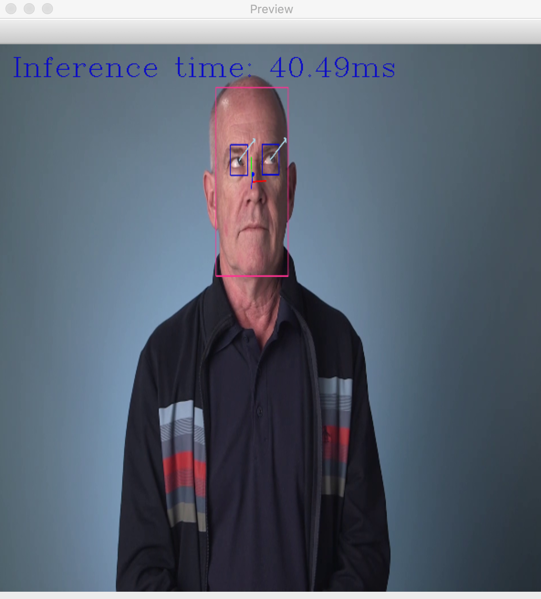

# Computer Pointer Controller
Project 3 of the **Intel® Edge AI for IoT Developers** Nanodegree Program.

### The project
The aim of the project is to develop an application that allows users to control the mouse pointer of their computers using their **eyes gaze**, captured through a webcam or a video file.

Using the _InferenceEngine API_ from Intel's OpenVino ToolKit, the application takes the output of a [gaze estimation model](https://docs.openvinotoolkit.org/latest/_models_intel_gaze_estimation_adas_0002_description_gaze_estimation_adas_0002.html) to move the mouse pointer. The gaze estimation model requires three inputs:

- The head pose
- The left eye image
- The right eye image.

To get these inputs, three other OpenVino models are used within the application:

- [Face Detection Model](https://docs.openvinotoolkit.org/latest/_models_intel_face_detection_adas_0001_description_face_detection_adas_0001.html)
- [Head Pose Estimation Model](https://docs.openvinotoolkit.org/latest/_models_intel_head_pose_estimation_adas_0001_description_head_pose_estimation_adas_0001.html)
- [Facial Landmarks Detection](https://docs.openvinotoolkit.org/latest/_models_intel_landmarks_regression_retail_0009_description_landmarks_regression_retail_0009.html)

The flow of data from the input, then amongst the different models and finally to the mouse controller looks like this:


The mouse pointer is controlled using the Python library [PyAutoGui](https://pypi.org/project/PyAutoGUI/).

## Requirements

### Hardware

* 6th to 10th generation Intel® Core™ processor with Iris® Pro graphics or Intel® HD Graphics.
* OR use of Intel® Neural Compute Stick 2 (NCS2)

### Software

*   Intel® Distribution of OpenVINO™ toolkit latest release
*   CMake
*   Python 3.5 to 3.7

## Project Set Up and Installation
To run the application, stick to the following steps:
#### Install Intel® Distribution of OpenVINO™ toolkit

Refer to the relevant instructions for the appropriate operating system [here](https://docs.openvinotoolkit.org/latest/index.html).

#### Clone the directory and install dependencies
Clone this directory:
```
git clone https://github.com/ElisaCovato/Computer-pointer-controller---Intel-Edge-AI-Nanodegree.git
```
The project directory contains a `media` folder which has a demo.mp4 file, that  can be used as input for the project. The `src` folder contains all the python scripts necessary to make `main.py` work. The `performance` folder contains some analysis on the application performance using different devices and/or different model precisions.

After cloning the directory, some python modules need to be installed. To do so, run :
```
pip3 install -r requirements.txt
```

#### Initialize OpenVino environments
Configure the build environment for the OpenVino toolkit by sourcing the `setupvars.sh` script:
```
source /opt/intel/openvino/bin/setupvars.sh
```
If successful, the terminal will prompt  `[setupvars.sh] OpenVINO environment initialized`.

#### Download models
To download the models, run the `dowload_model.sh` bash script:
```
bash download_model.sh
```
The script will create a folder `models` in the main directory containing the four models linked above. Each model is downloaded with its 3 different precision weights: FP32, FP16 and INT8. 

Note that the script makes use of the [Model Downloader](https://docs.openvinotoolkit.org/latest/_tools_downloader_README.html) included in the OpenVino toolkit. Alternatively, it is possible to download the models directly from the [Open Model Zoo Directory](https://download.01.org/openvinotoolkit/2018_R5/open_model_zoo/). It will then suffice to move the .xml and .bin files from the main application directory into `./model/intel/<model_name>/<model_precision>/`, e.g., `./models/intel/face-detection-adas-0001/FP16/`


## Demo
If all the previous steps have been completely successfully, it will be possible to run a demo with the following command.

In a terminal window, `cd` into the project directory and paste the following:
```buildoutcfg
python3 main.py \
-fm ./models/intel/face-detection-adas-0001/FP16/face-detection-adas-0001 \
-pm ./models/intel/head-pose-estimation-adas-0001/FP16/head-pose-estimation-adas-0001 \
-lm ./models/intel/landmarks-regression-retail-0009/FP16/landmarks-regression-retail-0009 \
-gm ./models/intel/gaze-estimation-adas-0002/FP16/gaze-estimation-adas-0002 \
-i ./media/demo.mp4
```
The mouse pointer will be positioned on the center of the screen and then it will start moving automatically on the screen, following the eyes gaze from the `demo.mp4` video. 

On the terminal, it will be prompt the _model loading time_, the _inference time_ for each frame, and the _frames per seconds_ once the video is finished. The output will look like this:
```commandline
Model loading time: 1.0 s
Inference time: 67.87ms
Inference time: 44.22ms
Inference time: 47.19ms
...
...
...
Inference time: 26.41ms
Inference time: 28.24ms
Inference time: 24.34ms
Total infer time: 26.48 s
FPS: 22.47 frames/s
WARNING:root:VideoStream ended...
```

## Documentation

#### Models
The models used are pre-trained OpenVino models:

- [Face Detection Model](https://docs.openvinotoolkit.org/latest/_models_intel_face_detection_adas_0001_description_face_detection_adas_0001.html)
- [Head Pose Estimation Model](https://docs.openvinotoolkit.org/latest/_models_intel_head_pose_estimation_adas_0001_description_head_pose_estimation_adas_0001.html)
- [Facial Landmarks Detection Model](https://docs.openvinotoolkit.org/latest/_models_intel_landmarks_regression_retail_0009_description_landmarks_regression_retail_0009.html)
- [Gaze estimation Model](https://docs.openvinotoolkit.org/latest/_models_intel_gaze_estimation_adas_0002_description_gaze_estimation_adas_0002.html)

#### Command line arguments
To get a description of all the command lines that can be used, run:
```commandline
python3 main.py --help
```
The possible arguments are:
```commandline
usage: main.py [-h] -fm FACE_MODEL -pm POSE_MODEL -lm LANDMARKS_MODEL -gm
               GAZE_MODEL -i INPUT [-l EXTENSIONS]
               [-prev FLAGS_PREVIEW [FLAGS_PREVIEW ...]]
               [-m_prec MOUSE_PRECISION] [-m_speed MOUSE_SPEED]
               [-prob PROB_THRESHOLD] [-d DEVICE] [-s] [-o_stats OUTPUT_STATS]

optional arguments:
  -h, --help            show this help message and exit
  -fm FACE_MODEL, --face_model FACE_MODEL
                        Path to folder with a pre-trained 'Face Detection
                        Model'. E.g. <path_dir>/<model_name>
  -pm POSE_MODEL, --pose_model POSE_MODEL
                        Path to folder with a pre-trained 'Head Pose Detection
                        Model'. . E.g. <path_dir>/<model_name>
  -lm LANDMARKS_MODEL, --landmarks_model LANDMARKS_MODEL
                        Path to folder with a pre-trained 'Facial Landmarks
                        Detection Model'. . E.g. <path_dir>/<model_name>
  -gm GAZE_MODEL, --gaze_model GAZE_MODEL
                        Path to folder with a pre-trained 'Gaze Estimation
                        Model'. . E.g. <path_dir>/<model_name>
  -i INPUT, --input INPUT
                        Path to video file or image. Enter 'cam' for webcam
                        stream.
  -l EXTENSIONS, --extensions EXTENSIONS
                        (Optional) MKLDNN (CPU)-targeted custom
                        layers.Absolute path to a shared library with
                        thekernels impl.
  -prev FLAGS_PREVIEW [FLAGS_PREVIEW ...], --flags_preview FLAGS_PREVIEW [FLAGS_PREVIEW ...]
                        (Optional) Show models detection outputs. Add 'fm' for
                        face detection,lm for landmarks, pm for head pose, gm
                        for gaze estimation,vo for video only output without
                        models detection output, stats for displaying live
                        inference time.Flags needs to be separated by space.
  -m_prec MOUSE_PRECISION, --mouse_precision MOUSE_PRECISION
                        (Optional) Specify mouse precision (how much the mouse
                        moves): 'high', 'medium', 'low'.Default is high.
  -m_speed MOUSE_SPEED, --mouse_speed MOUSE_SPEED
                        (Optional) Specify mouse speed (how many secs before
                        it moves): 'immediate'(0s),
                        'fast'(0.1s),'medium'(0.5s) and 'slow'(1s). Default is
                        immediate.
  -prob PROB_THRESHOLD, --prob_threshold PROB_THRESHOLD
                        (Optional) Probability threshold for detection
                        filtering (0.5 by default)
  -d DEVICE, --device DEVICE
                        (Optional) Specify the target device to infer on: CPU,
                        GPU, FPGA or MYRIAD is acceptable. Default device is
                        CPU.
  -s, --sync_mode       (Optional) Add this flag to specify synchronous
                        inference. Default false: Asynchronous inference will
                        be performed.
  -o_stats OUTPUT_STATS, --output_stats OUTPUT_STATS
                        (Optional) Specify output file where to print
                        performance stats.Example
                        <output_directory_path>/<file name>.txt
```
**Model** and **input** paths are **required**. Note that it will suffices to insert the path of the model and the name without specifying the `.xml` or `.bin` extension, e.g. `./models/intel/face-detection-adas-0001/FP16/face-detection-adas-0001`. For the input, the user can either specify a _video file_ path or `CAM` to use the webcam feed to move the pointer.

The user can also preview the video/webcam feed on a window, either only the feed or with one or more of the outputs of intermediate models. To do so, it will suffices to use the `-prev` argument followed by the chosen option(s) as detailed above. For example, using all the preview flag options, the video output will be like this:



The application can run on different devices. It is possible to specify the target device by using the `-d` argument. By default, the inference will run on CPU, but possible options are GPU, MYRIAD (VPU/NCS2) and FPGA. Moreover, if the `-sync_mode` argument is not specified, the application will perform **asynchronous** inference rather than a synchronous one.

To print on file some stats about the application, the user needs to pass a `.txt` file path to the `-o_stats` argument. Once the application finishes to run, it will print on the specified file model loading time, total inference time and frames per second. By default, the same statistics are printed on terminal while the application runs. 


## Benchmarks
*TODO:* Include the benchmark results of running your model on multiple hardwares and multiple model precisions. Your benchmarks can include: model loading time, input/output processing time, model inference time etc.

## Results
*TODO:* Discuss the benchmark results and explain why you are getting the results you are getting. For instance, explain why there is difference in inference time for FP32, FP16 and INT8 models.

## Stand Out Suggestions
This is where you can provide information about the stand out suggestions that you have attempted.

### Async Inference
If you have used Async Inference in your code, benchmark the results and explain its effects on power and performance of your project.

### Edge Cases
There will be certain situations that will break your inference flow. For instance, lighting changes or multiple people in the frame. Explain some of the edge cases you encountered in your project and how you solved them to make your project more robust.

## License
[MIT License](LICENSE.MIT)