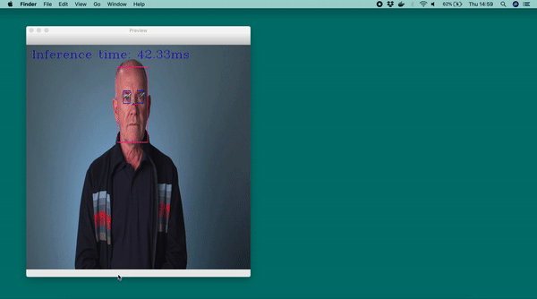
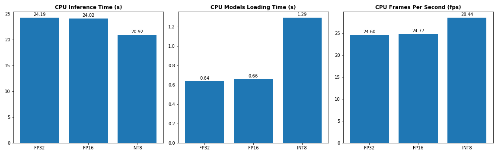
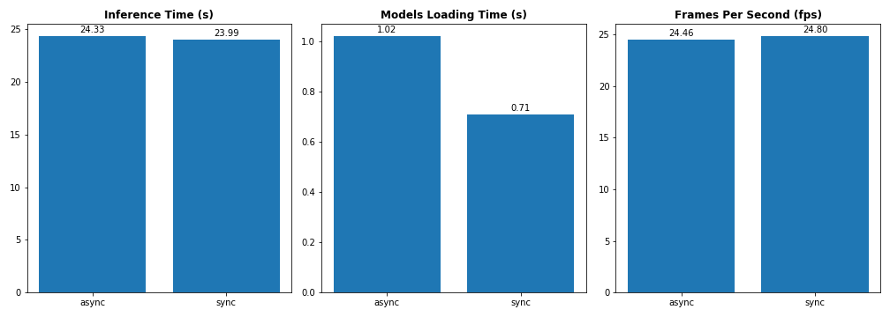

# Computer Pointer Controller
Project 3 of the **Intel® Edge AI for IoT Developers** Nanodegree Program.



### The project
The aim of the project is to develop an application that allows users to control the mouse pointer of their computers using their **eyes gaze**, captured through a webcam or a video file.

Using the _InferenceEngine API_ from Intel's OpenVino ToolKit, the application takes the output of a [gaze estimation model](https://docs.openvinotoolkit.org/latest/_models_intel_gaze_estimation_adas_0002_description_gaze_estimation_adas_0002.html) to move the mouse pointer. The gaze estimation model requires three inputs:

- The head pose
- The left eye image
- The right eye image.

To get these inputs, three other OpenVino models are used within the application:

- [Face Detection Model](https://docs.openvinotoolkit.org/latest/_models_intel_face_detection_adas_0001_description_face_detection_adas_0001.html)
- [Head Pose Estimation Model](https://docs.openvinotoolkit.org/latest/_models_intel_head_pose_estimation_adas_0001_description_head_pose_estimation_adas_0001.html)
- [Facial Landmarks Detection](https://docs.openvinotoolkit.org/latest/_models_intel_landmarks_regression_retail_0009_description_landmarks_regression_retail_0009.html)

The flow of data from the input, then amongst the different models and finally to the mouse controller looks like this:


The mouse pointer is controlled using the Python library [PyAutoGui](https://pypi.org/project/PyAutoGUI/).

## Requirements

### Hardware

* 6th to 10th generation Intel® Core™ processor with Iris® Pro graphics or Intel® HD Graphics.
* OR use of Intel® Neural Compute Stick 2 (NCS2)

### Software

*   Intel® Distribution of OpenVINO™ toolkit latest release
*   CMake
*   Python 3.5 to 3.7

## Project Set Up and Installation
To run the application, stick to the following steps:
#### Install Intel® Distribution of OpenVINO™ toolkit

Refer to the relevant instructions for the appropriate operating system [here](https://docs.openvinotoolkit.org/latest/index.html).

#### Clone the directory and install dependencies
Clone this directory:
```
git clone https://github.com/ElisaCovato/Computer-pointer-controller---Intel-Edge-AI-Nanodegree.git
```

After cloning the directory, some python modules need to be installed. To do so, run :
```
pip3 install -r requirements.txt
```

#### Initialize OpenVino environments
Configure the build environment for the OpenVino toolkit by sourcing the `setupvars.sh` script:
```
source /opt/intel/openvino/bin/setupvars.sh
```
If successful, the terminal will prompt  `[setupvars.sh] OpenVINO environment initialized`.

#### Download models
To download the models, run the `dowload_model.sh` bash script:
```
bash download_model.sh
```
The script will create a folder `models` in the main directory containing the four models linked above. Each model is downloaded with its 3 different precision weights: FP32, FP16 and INT8. 

Note that the script makes use of the [Model Downloader](https://docs.openvinotoolkit.org/latest/_tools_downloader_README.html) included in the OpenVino toolkit. Alternatively, it is possible to download the models directly from the [Open Model Zoo Directory](https://download.01.org/openvinotoolkit/2018_R5/open_model_zoo/). It will then suffice to move the .xml and .bin files from the main application directory into `./model/intel/<model_name>/<model_precision>/`, e.g., `./models/intel/face-detection-adas-0001/FP16/`


## Demo
If all the previous steps have been completely successfully, it will be possible to run a demo with the following command.

In a terminal window, `cd` into the project directory and paste the following:
```buildoutcfg
python3 main.py \
-fm ./models/intel/face-detection-adas-0001/FP16/face-detection-adas-0001 \
-pm ./models/intel/head-pose-estimation-adas-0001/FP16/head-pose-estimation-adas-0001 \
-lm ./models/intel/landmarks-regression-retail-0009/FP16/landmarks-regression-retail-0009 \
-gm ./models/intel/gaze-estimation-adas-0002/FP16/gaze-estimation-adas-0002 \
-i ./media/demo.mp4
```
The mouse pointer will be positioned on the center of the screen and then it will start moving automatically on the screen, following the eyes gaze from the `demo.mp4` video. 

On the terminal, it will be prompt the _model loading time_, the _inference time_ for each frame, and the _frames per seconds_ once the video is finished. The output will look like this:
```commandline
Model loading time: 1.0 s
Inference time: 67.87ms
Inference time: 44.22ms
Inference time: 47.19ms
...
...
...
Inference time: 26.41ms
Inference time: 28.24ms
Inference time: 24.34ms
Total infer time: 26.48 s
FPS: 22.47 frames/s
WARNING:root:VideoStream ended...
```

## Documentation

#### Models
The models used are pre-trained OpenVino models:

- [Face Detection Model](https://docs.openvinotoolkit.org/latest/_models_intel_face_detection_adas_0001_description_face_detection_adas_0001.html)
- [Head Pose Estimation Model](https://docs.openvinotoolkit.org/latest/_models_intel_head_pose_estimation_adas_0001_description_head_pose_estimation_adas_0001.html)
- [Facial Landmarks Detection Model](https://docs.openvinotoolkit.org/latest/_models_intel_landmarks_regression_retail_0009_description_landmarks_regression_retail_0009.html)
- [Gaze estimation Model](https://docs.openvinotoolkit.org/latest/_models_intel_gaze_estimation_adas_0002_description_gaze_estimation_adas_0002.html)


#### Project Directory Structure
If all the setup steps have been followed correctly, the project directory will look like this:
```commandline
├── LICENSE
├── README.md
├── download_model.sh
├── main.py
├── media
│   ├── data_flow.png
│   ├── demo.mp4
│   └── flags_preview.png
├── models
│   └── intel
│       ├── face-detection-adas-0001
│       │   ├── FP16
│       │   │   ├── face-detection-adas-0001.bin
│       │   │   └── face-detection-adas-0001.xml
│       │   ├── FP16-INT8
│       │   │   ├── face-detection-adas-0001.bin
│       │   │   └── face-detection-adas-0001.xml
│       │   └── FP32
│       │       ├── face-detection-adas-0001.bin
│       │       └── face-detection-adas-0001.xml
│       ├── gaze-estimation-adas-0002
│       │   ├── FP16
│       │   │   ├── gaze-estimation-adas-0002.bin
│       │   │   └── gaze-estimation-adas-0002.xml
│       │   ├── FP16-INT8
│       │   │   ├── gaze-estimation-adas-0002.bin
│       │   │   └── gaze-estimation-adas-0002.xml
│       │   └── FP32
│       │       ├── gaze-estimation-adas-0002.bin
│       │       └── gaze-estimation-adas-0002.xml
│       ├── head-pose-estimation-adas-0001
│       │   ├── FP16
│       │   │   ├── head-pose-estimation-adas-0001.bin
│       │   │   └── head-pose-estimation-adas-0001.xml
│       │   ├── FP16-INT8
│       │   │   ├── head-pose-estimation-adas-0001.bin
│       │   │   └── head-pose-estimation-adas-0001.xml
│       │   └── FP32
│       │       ├── head-pose-estimation-adas-0001.bin
│       │       └── head-pose-estimation-adas-0001.xml
│       └── landmarks-regression-retail-0009
│           ├── FP16
│           │   ├── landmarks-regression-retail-0009.bin
│           │   └── landmarks-regression-retail-0009.xml
│           ├── FP16-INT8
│           │   ├── landmarks-regression-retail-0009.bin
│           │   └── landmarks-regression-retail-0009.xml
│           └── FP32
│               ├── landmarks-regression-retail-0009.bin
│               └── landmarks-regression-retail-0009.xml
├── performance
│   ├── CPU
│   │   ├── FP16.txt
│   │   ├── FP32.txt
│   │   └── INT8.txt
│   ├── NCS2
│   │   └── FP16.txt
│   ├── check_performance.ipynb
│   ├── cpu_performance.png
│   └── ncs2_vs_cpu.png
├── requirements.txt
├── src
   ├── face_detection.py
   ├── facial_landmarks_detection.py
   ├── gaze_estimation.py
   ├── head_pose_estimation.py
   ├── input_feeder.py
   ├── mouse_controller.py
   └── visualizer.py
```

The project directory contains a `media` folder which has a demo.mp4 file, that  can be used as input for the project.  The `performance` folder contains some analysis on the application performance using different devices and/or different model precisions.

The `src` folder contains all the python scripts necessary to make `main.py` work: there is a script for each model used within the application; `input_feeder.py` handles the video and webcam inputs; the functions to control the mouse pointer are in `mouse_controller.py`; `visualizer.py` handles the preview for each of the models' outputs.


#### Command line arguments
To get a description of all the command lines that can be used, run:
```commandline
python3 main.py --help
```
The possible arguments are:
```commandline
usage: main.py [-h] -fm FACE_MODEL -pm POSE_MODEL -lm LANDMARKS_MODEL -gm
               GAZE_MODEL -i INPUT [-l EXTENSIONS]
               [-prev FLAGS_PREVIEW [FLAGS_PREVIEW ...]]
               [-m_prec MOUSE_PRECISION] [-m_speed MOUSE_SPEED]
               [-prob PROB_THRESHOLD] [-d DEVICE] [-s] [-o_stats OUTPUT_STATS]

optional arguments:
  -h, --help            show this help message and exit
  -fm FACE_MODEL, --face_model FACE_MODEL
                        Path to folder with a pre-trained 'Face Detection
                        Model'. E.g. <path_dir>/<model_name>
  -pm POSE_MODEL, --pose_model POSE_MODEL
                        Path to folder with a pre-trained 'Head Pose Detection
                        Model'. . E.g. <path_dir>/<model_name>
  -lm LANDMARKS_MODEL, --landmarks_model LANDMARKS_MODEL
                        Path to folder with a pre-trained 'Facial Landmarks
                        Detection Model'. . E.g. <path_dir>/<model_name>
  -gm GAZE_MODEL, --gaze_model GAZE_MODEL
                        Path to folder with a pre-trained 'Gaze Estimation
                        Model'. . E.g. <path_dir>/<model_name>
  -i INPUT, --input INPUT
                        Path to video file or image. Enter 'cam' for webcam
                        stream.
  -l EXTENSIONS, --extensions EXTENSIONS
                        (Optional) MKLDNN (CPU)-targeted custom
                        layers.Absolute path to a shared library with
                        thekernels impl.
  -prev FLAGS_PREVIEW [FLAGS_PREVIEW ...], --flags_preview FLAGS_PREVIEW [FLAGS_PREVIEW ...]
                        (Optional) Show models detection outputs. Add 'fm' for
                        face detection,lm for landmarks, pm for head pose, gm
                        for gaze estimation,vo for video only output without
                        models detection output, stats for displaying live
                        inference time.Flags needs to be separated by space.
  -m_prec MOUSE_PRECISION, --mouse_precision MOUSE_PRECISION
                        (Optional) Specify mouse precision (how much the mouse
                        moves): 'high', 'medium', 'low'.Default is high.
  -m_speed MOUSE_SPEED, --mouse_speed MOUSE_SPEED
                        (Optional) Specify mouse speed (how many secs before
                        it moves): 'immediate'(0s),
                        'fast'(0.1s),'medium'(0.5s) and 'slow'(1s). Default is
                        immediate.
  -prob PROB_THRESHOLD, --prob_threshold PROB_THRESHOLD
                        (Optional) Probability threshold for detection
                        filtering (0.5 by default)
  -d DEVICE, --device DEVICE
                        (Optional) Specify the target device to infer on: CPU,
                        GPU, FPGA or MYRIAD is acceptable. Default device is
                        CPU.
  -s, --sync_mode       (Optional) Add this flag to specify synchronous
                        inference. Default false: Asynchronous inference will
                        be performed.
  -o_stats OUTPUT_STATS, --output_stats OUTPUT_STATS
                        (Optional) Specify output file where to print
                        performance stats.Example
                        <output_directory_path>/<file name>.txt
```
**Model** and **input** paths are **required**. Note that it will suffices to insert the path of the model and the name without specifying the `.xml` or `.bin` extension, e.g. `./models/intel/face-detection-adas-0001/FP16/face-detection-adas-0001`. For the input, the user can either specify a _video file_ path or `cam` to use the webcam feed to move the pointer.

The user can also preview the video/webcam feed on a window, either only the feed or with one or more of the outputs of intermediate models. To do so, it will suffices to use the `-prev` argument followed by the chosen option(s) as detailed above. For example, using all the preview flag options, the video output will be like this:


The application can run on different devices. It is possible to specify the target device by using the `-d` argument. By default, the inference will run on CPU, but possible options are GPU, MYRIAD (VPU/NCS2) and FPGA. Moreover, if the `-sync_mode` argument is not specified, the application will perform **asynchronous** inference rather than a synchronous one.

To print on file some stats about the application, the user needs to pass a `.txt` file path to the `-o_stats` argument. Once the application finishes to run, it will print on the specified file model loading time, total inference time and frames per second. By default, the same statistics are printed on terminal while the application runs. 

### Stop the application
If the user wishes to stop the application, especially when using a webcam feed, it will be suffices press `CTRL + c` on the terminal window. The application will print an "_Application interrupted by user_" message.  
In the case of a preview window open, by pressing `ESC` the preview will stop and the application will be interrupted as well.

## Benchmarks
The application has been tested on different devices and using different model precisions. For more details see this [Python notebook](./performance/check_performance.ipynb).

In particular, testing the application on a **CPU** (Intel Core i5, 2.3 GHz ) using different model precision has produced the following values:



The precision used (FP32/FP16/INT8) was equivalent across the four models.

On the other hand, the values obtained running it on a **VPU** (Neural Compute Stick 2) vs. CPU are as follow:

 

Note that this has been tested using FP16 precision models for both NCS2 and CPU, since NCS2 only accepts FP16 models.

## Results
The benchmark results above show clearly that using models with lower precision produces faster inference and less memory usage (more frames per second). 

The results for FP32 and FP16 are very similar, and they overcome the results with INT8 precision models for the loading time.

In terms of performance and accuracy, because face detection is a key information that we pass to the other three models, it would be recommended, when running the application on a CPU, to use a Face Detection model in Precision 32 bits and the other models in 16 bits. In the case of a VPU/NCS2 instead, 
Using this model combination for the CPU, we would get:

 <p id ="model-combo"></p>
 
|Model Combination                      | Total inference time | Models loading time | Frames Per Second |
| ------------------------------------- | ------------------- | -------------------- | ----------------- |
| face-detection-adas - FP32<br>head-pose-estimation-adas - FP16<br>facial-landmarks-35-adas - FP16<br>gaze-estimation-adas - FP16|   24.24s |  0.67 | 24.57 fps |

which is not very far from the benchmark results using all models either with FP32 or FP16 precision. Moreover, using models with lower precision takes up less memory footprint.

## Extras

### Multiple or no people in frame
If multiple people are detected in the frame, this might cause ambiguities while performing gaze estimation to move the pointer. Therefore, if this happens, the application will just keep the first detection and discard the rest, so only the gaze of one detected person will be used to move the mouse pointer.

On the other hand, if no people are detected on frame, a message will be printed on terminal. The same message will be also printed on a preview screen if the `-prev` argument has been specified. 

### Lighting
Not enough light, either on a video or webcam feed, might cause the application to struggle detecting faces. As for the when there are no people in the frame, a message will be printed on terminal. The same message will be also printed on a preview screen if the -prev argument has been specified.

### Async Inference
By default, the application will run asynchronous inference. However the user can specify the `-sync_mode` comm and line argument to run inferences in synchronous mode. This will impact the performance of the application. Using the model combination defined [above](#model-combo), and running the application on CPU, we obtain the following performance timinings:



In this case there is no much difference between the two inference modes. This because asynchronous inference is highly recommended when data or service availability/connectivity are low or oversaturated with demand, which is not the case for this specific application and the way in which has been run. However, it is preferable running async inference to overcome potential problems with connectivity and demand.


## License
[MIT License](LICENSE.MIT)